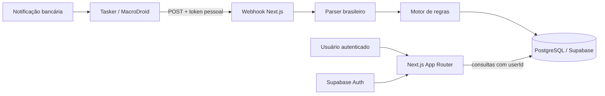

# Cadê Meu Dinheiro? — livro-caixa pessoal

**Cadê Meu Dinheiro?** é uma plataforma multiusuário para transformar a pergunta inevitável do fim do mês em contexto: despesas manuais ou capturadas do Android, categorização automática, orçamento, metas, tendências, recorrências e importação de extratos.

O conceito visual é um **livro-caixa editorial**: papel mineral, tinta, linhas de régua, vermelho de carimbo e verde contábil. A interface usa composição assimétrica e densidade de informação, sem o padrão de cards brancos arredondados, sombras suaves ou gradientes azul/roxo.

> Limitação importante: um site não pode ler as notificações do sistema do celular. No Android, Tasker, MacroDroid ou um app auxiliar recebe a permissão de acesso às notificações e envia o texto para o webhook autenticado do Cadê?.

## O que está implementado

### MVP

- cadastro, confirmação por e-mail, login e logout com Supabase Auth;
- espaço totalmente separado por usuário em consultas, mutações, tokens e políticas RLS;
- registro manual de entradas e despesas;
- webhook pessoal com Bearer token, hash HMAC em repouso, revogação e deduplicação;
- extração de valor, estabelecimento e data de notificações bancárias brasileiras;
- categorias iniciais: alimentação, transporte, moradia, lazer, saúde e outros;
- regras por palavras-chave e fallback em “Outros”;
- correção de categoria com opção de aprender o estabelecimento para o futuro;
- dashboard com total mensal, comparação, tendência de seis meses e peso por categoria;
- orçamento mensal por categoria, limiar de alerta e indicação de estouro;
- metas de reserva com progresso e feedback ao concluir;
- detecção indicativa de gastos recorrentes em uma janela de 120 dias;
- importação CSV/OFX com categorização e proteção contra duplicatas;
- layout responsivo para desktop e celular.

### v2 priorizada

1. alertas push/e-mail quando um orçamento alcança o limiar (hoje o alerta é visual);
2. editor de categorias, cores e regras com auditoria das decisões automáticas;
3. PWA offline para lançamentos e sincronização posterior;
4. app Android mínimo com fila local, retry e seleção de apps bancários;
5. parcelamentos, faturas e calendário de vencimentos;
6. relatórios exportáveis e comparação com médias móveis;
7. tela dedicada a assinaturas, confirmação e cancelamento de falsos recorrentes.

### Nice-to-have

- classificação estatística local, sempre subordinada às regras explícitas;
- Open Finance por provedor homologado;
- espaços familiares com papéis e despesas compartilhadas;
- anexos de comprovantes com política de retenção;
- previsão de fluxo de caixa e cenários de meta.

## Arquitetura



- **Frontend e backend:** Next.js 15, App Router, Server Components e Server Actions.
- **Autenticação:** Supabase Auth por e-mail/senha e sessão em cookies SSR.
- **Domínio e banco:** Prisma 6 + PostgreSQL do Supabase.
- **Gráficos:** Recharts.
- **Validação:** Zod no limite público do webhook.
- **Hospedagem:** Vercel; banco e auth permanecem no Supabase.

O UUID em `User.id` é o mesmo UUID de `auth.users.id`. O primeiro acesso cria o perfil local e as categorias/regras iniciais em uma transação. Toda consulta de negócio parte do usuário validado pelo Supabase e contém `userId`; IDs recebidos de formulários são novamente conferidos contra essa conta. A migração também habilita RLS para acessos pela Data API do Supabase.

Mais detalhes: [arquitetura e design](docs/ARQUITETURA.md).

## Modelo de dados

| Entidade | Responsabilidade | Isolamento |
|---|---|---|
| `User` | perfil, moeda e fuso; espelha `auth.users` | `id = auth.uid()` |
| `Category` | taxonomia pessoal, cor e ordem | `userId` |
| `CategoryRule` | palavra-chave, prioridade e categoria | `userId` |
| `Transaction` | valor, data, origem, estabelecimento e categoria | `userId` |
| `Budget` | limite e limiar por categoria/mês | `userId` |
| `Goal` | alvo, valor guardado, prazo e status | `userId` |
| `WebhookToken` | somente hash, prefixo, uso e revogação | `userId` |

## Rodar localmente

Requisitos: Node.js 20.9+ e um projeto Supabase.

1. Clone o repositório e instale:

   ```bash
   git clone https://github.com/Gaalbu/cade-meu-dinheiro.git
   cd cade-meu-dinheiro
   npm install
   ```

2. No Supabase, crie um projeto. Em **Project Settings → Database**, copie:

   - a connection string do pooler (porta `6543`) para `DATABASE_URL`;
   - a connection string direta (porta `5432`) para `DIRECT_URL`.

3. Em **Project Settings → API**, copie Project URL e a chave `anon`/publishable.

4. Copie `.env.example` para `.env.local`, preencha os valores e gere o pepper:

   ```bash
   openssl rand -hex 32
   ```

5. Aplique a migração e inicie:

   ```bash
   npm run db:deploy
   npm run dev
   ```

6. Em **Authentication → URL Configuration** no Supabase:

   - Site URL local: `http://localhost:3000`;
   - Redirect URL local: `http://localhost:3000/**`.

Abra `http://localhost:3000`, crie a conta e confirme o e-mail. As categorias padrão aparecem no primeiro acesso autenticado.

## Variáveis de ambiente

| Variável | Onde obter | Exposição |
|---|---|---|
| `DATABASE_URL` | Supabase pooler, porta 6543 | servidor |
| `DIRECT_URL` | Supabase conexão direta, porta 5432 | servidor/migrations |
| `NEXT_PUBLIC_SUPABASE_URL` | Supabase Project URL | pública por definição |
| `NEXT_PUBLIC_SUPABASE_ANON_KEY` | Supabase anon/publishable key | pública por definição |
| `WEBHOOK_SECRET` | `openssl rand -hex 32` | segredo do servidor |
| `NEXT_PUBLIC_APP_URL` | URL local ou de produção | pública por definição |

Nunca use a `service_role` no navegador. O token pessoal do webhook também nunca deve entrar em Git, screenshots ou logs.

## Webhook pessoal

Na tela **Ajustes**, dê um nome ao aparelho e clique em **Gerar novo token**. O valor completo aparece uma única vez; o banco guarda somente seu hash HMAC. Um usuário pode ter vários aparelhos e revogar cada um isoladamente.

Endpoint:

```text
POST https://SEU-DOMINIO.vercel.app/api/webhook/transacao
Authorization: Bearer cade_wh_SEU_TOKEN
Content-Type: text/plain
Idempotency-Key: opcional-mas-recomendado

Compra aprovada de R$ 86,40 em MERCADO MODELO no cartão final 0291
```

Também aceita JSON:

```json
{
  "text": "Compra aprovada de R$ 86,40 em MERCADO MODELO",
  "occurredAt": "2026-08-01T12:42:00-03:00",
  "packageName": "com.exemplo.banco",
  "idempotencyKey": "notificacao-123"
}
```

Resposta de sucesso (`201`):

```json
{
  "ok": true,
  "transaction": {
    "id": "uuid",
    "amount": 86.4,
    "merchant": "MERCADO MODELO",
    "category": "Alimentação",
    "occurredAt": "2026-08-01T15:42:00.000Z"
  }
}
```

O webhook aceita `Authorization: Bearer ...` ou `X-Webhook-Token`. O `Idempotency-Key` evita lançamentos repetidos; sem ele, o servidor usa texto + minuto extraído como aproximação.

### Teste com curl

```bash
curl -i -X POST 'https://SEU-DOMINIO.vercel.app/api/webhook/transacao' \
  -H 'Authorization: Bearer cade_wh_SEU_TOKEN' \
  -H 'Content-Type: text/plain' \
  -H 'Idempotency-Key: teste-001' \
  --data 'Compra aprovada de R$ 15,90 em PADARIA PRIMAVERA'
```

## Configurar Tasker

O Tasker precisa da permissão **Acesso às notificações** no Android. Os nomes podem variar um pouco por versão/fabricante.

1. No Cadê?, abra **Ajustes**, gere um token e copie também a URL mostrada.
2. No Tasker, abra **Profiles → + → Event → UI → Notification**.
3. Em **Owner Application**, selecione somente os apps dos bancos/cartões desejados. Marque **New Only** se disponível, para reduzir atualizações duplicadas.
4. Conceda o acesso às notificações quando o Android solicitar.
5. Vincule uma nova Task e adicione **Net → HTTP Request**.
6. Preencha:

   ```text
   Method: POST
   URL: https://SEU-DOMINIO.vercel.app/api/webhook/transacao
   Headers:
   Authorization:Bearer cade_wh_SEU_TOKEN
   Content-Type:text/plain
   Idempotency-Key:%TIMES
   Body: %evtprm3
   Timeout: 20
   ```

7. Se o texto chegar incompleto, teste uma ação temporária **Flash → `%evtprm()`**. Em eventos de notificação, `%evtprm2` costuma conter o título e `%evtprm3` as demais partes; nesse caso use `%evtprm2 %evtprm3` no Body.
8. Execute a Task manualmente com um texto de teste ou aguarde uma compra pequena. Confirme a nova linha em **Transações**.
9. Se quiser restringir melhor, adicione condições no perfil contendo “compra”, “Pix”, “pagamento” ou “cartão”.

O Tasker documenta que os parâmetros do evento são expostos em `%evtprm` e que a ação HTTP Request envia o Body sem transformá-lo. Por isso `text/plain` é usado: aspas e quebras da notificação não invalidam JSON. Veja a [documentação de parâmetros de evento](https://tasker.joaoapps.com/userguide/en/eventcontext.html), [variáveis de notificação](https://tasker.joaoapps.com/userguide/en/variables.html) e [HTTP Request](https://tasker.joaoapps.com/userguide/en/help/ah_http_request.html).

## Configurar MacroDroid

1. No Cadê?, gere o token em **Ajustes**.
2. No MacroDroid, crie uma macro e escolha **Trigger → Notification → Notification Received**.
3. Selecione apenas os apps bancários, marque **Ignore ongoing/persistent notifications** e **Prevent multiple triggers** quando disponíveis.
4. Conceda a permissão de acesso às notificações.
5. Adicione **Action → Connectivity → HTTP Request**:

   ```text
   Method: POST
   URL: https://SEU-DOMINIO.vercel.app/api/webhook/transacao
   Content type: text/plain
   Header Authorization: Bearer cade_wh_SEU_TOKEN
   Body: {not_title} {notification}
   ```

6. Insira `{not_title}` e `{notification}` pelo botão de texto mágico (`…`), evitando erros de digitação.
7. Salve o código de resposta HTTP em uma variável opcional: `201` indica criação; `401`, token incorreto/revogado; `422`, texto sem valor reconhecível.
8. Teste e confira **Transações** no Cadê?.

A documentação do MacroDroid confirma a exigência de acesso às notificações, os textos mágicos e os headers/body da ação HTTP: [Notification trigger](https://www.macrodroidforum.com/wiki/index.php?title=Trigger%3A_Notification) e [HTTP Request action](https://macrodroidforum.com/wiki/index.php/Action%3A_HTTP_Request).

> Android 15+ e alguns bancos podem ocultar ou redigir o conteúdo sensível. Nesse caso, a automação não terá valor/estabelecimento para enviar; use lançamento manual, importação de extrato ou um formato de notificação permitido pelo próprio banco.

## Importar extratos

- **CSV:** cabeçalho obrigatório com variantes de `Data`, `Valor` e `Descrição`/`Estabelecimento`. `Tipo` com “receita”, “crédito” ou “entrada” identifica entradas; o padrão é despesa.
- **OFX:** lê blocos `STMTTRN`, `TRNAMT`, `DTPOSTED`, `NAME`/`MEMO` e `FITID`.
- limite por arquivo: 5 MB e 5.000 movimentos;
- `FITID` ou a combinação data/valor/estabelecimento produz a impressão de deduplicação.

## Deploy na Vercel

1. Garanta que o repositório esteja no GitHub e com a branch `main` atualizada.
2. Em [vercel.com/new](https://vercel.com/new), escolha **Import Git Repository** e selecione `Gaalbu/cade-meu-dinheiro`.
3. Framework Preset: **Next.js**. Root Directory: `./`. Install Command: `npm install`. Build Command: `npm run build`.
4. Em **Environment Variables**, adicione as seis variáveis da tabela acima para Production, Preview e Development. Em produção, `NEXT_PUBLIC_APP_URL` deve ser a URL final sem barra, por exemplo `https://fio.exemplo.com` ou o domínio Vercel.
5. Antes do primeiro tráfego de produção, aplique a migration com as credenciais do banco de produção:

   ```bash
   npm run db:deploy
   ```

   Alternativa: cole `prisma/migrations/20260801160000_init/migration.sql` no SQL Editor do Supabase uma única vez.

6. No Supabase, abra **Authentication → URL Configuration**:

   - Site URL: seu domínio de produção;
   - Redirect URLs: `https://SEU-DOMINIO/**` e, se usar previews, os padrões necessários da Vercel.

7. Faça o deploy. Crie uma conta de teste, confirme o e-mail, gere um token e execute o curl de teste.
8. Só depois configure Tasker/MacroDroid com a URL final. Tokens de preview não devem ser reutilizados em produção se apontarem para bancos diferentes.

## Scripts

```text
npm run dev          servidor local
npm run build        Prisma generate + build de produção
npm run lint         regras Next.js, React e acessibilidade
npm run typecheck    verificação TypeScript
npm test             testes do parser e categorizador
npm run db:migrate   cria migration em desenvolvimento
npm run db:deploy    aplica migrations pendentes
npm run db:studio    inspeciona dados localmente
```

## Segurança e privacidade

- senha e sessão são responsabilidade do Supabase Auth;
- o token completo do webhook aparece uma única vez e nunca é persistido;
- `WEBHOOK_SECRET` funciona como pepper do HMAC e não pode mudar sem invalidar os tokens;
- toda leitura/mutação de domínio filtra `userId` obtido da sessão, nunca do formulário;
- webhook resolve o usuário exclusivamente pelo hash do token;
- RLS protege acessos diretos pela Data API do Supabase;
- notificações brutas são armazenadas para auditoria/correção; uma política de retenção configurável está prevista para v2;
- revogue imediatamente um token se ele for exposto.

## Estrutura principal

```text
app/
  (app)/                  área autenticada
    dashboard/
    transacoes/
    planejamento/
    configuracoes/
  actions/                Server Actions autenticadas
  api/webhook/transacao/  entrada do Android
components/               UI e gráficos
lib/
  supabase/               sessão SSR
  transactions/           parser, regras e importação
prisma/
  schema.prisma
  migrations/
tests/                    casos puros do motor financeiro
```

## Licença

Projeto pessoal. Defina uma licença antes de aceitar contribuições externas.
